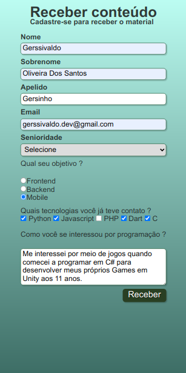

<h1 align="center"> Form created in HTML and CSS</h1>
<h5 align="center" font-weigth="bold">  This is a very simple application that serves as an introductory example for frontend programming studies</h5>

  
  <h6 align="center">Page on Mobile</h6>

### References for technologies used
  
 
    
- [HTML](https://developer.mozilla.org/en-US/docs/Web/HTML) - The HyperText Markup Language, or HTML is the standard markup language for documents designed to be displayed in a web browser. It can be assisted by technologies such as Cascading Style Sheets and scripting languages such as JavaScript.

- [CSS](https://developer.mozilla.org/en-US/docs/Web/CSS) - Cascading Style Sheets is a style sheet language used for describing the presentation of a document written in a markup language such as HTML. CSS is a cornerstone technology of the World Wide Web, alongside HTML and JavaScript.

### Requirements to run the application on your machine
   One browser that can interpret HTML5 and files existings in repository
